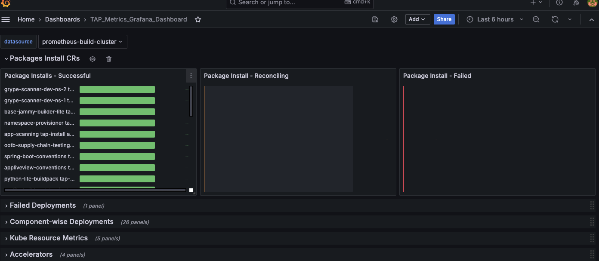
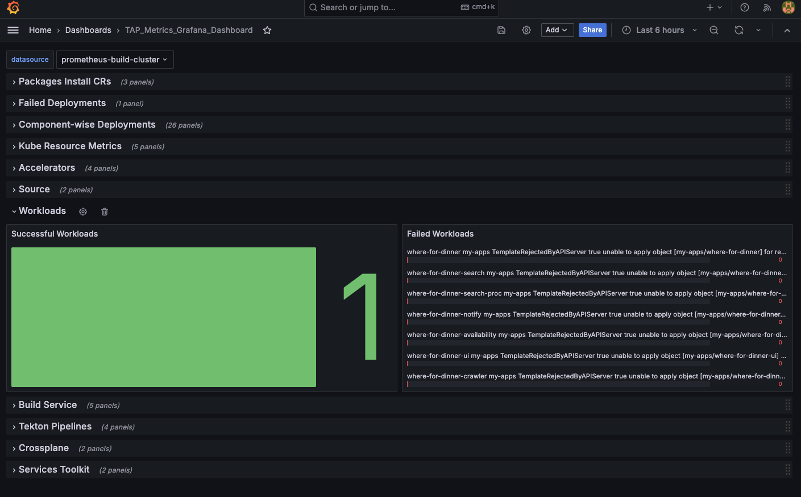
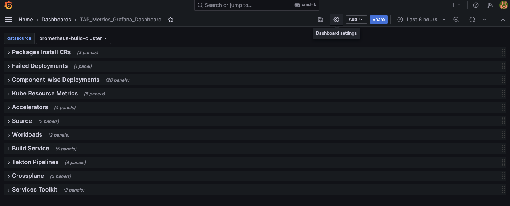
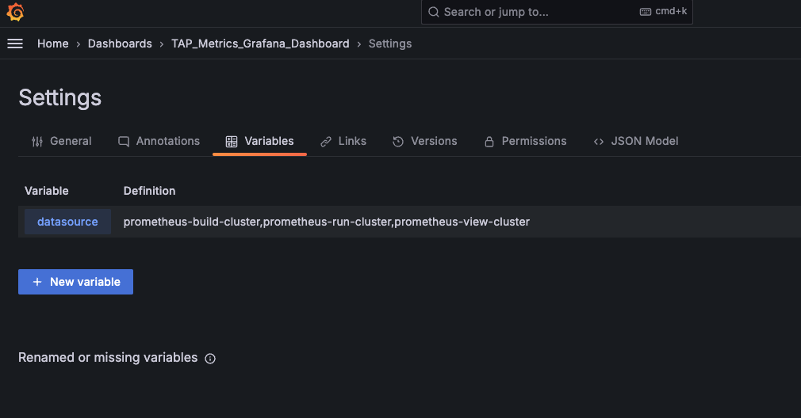
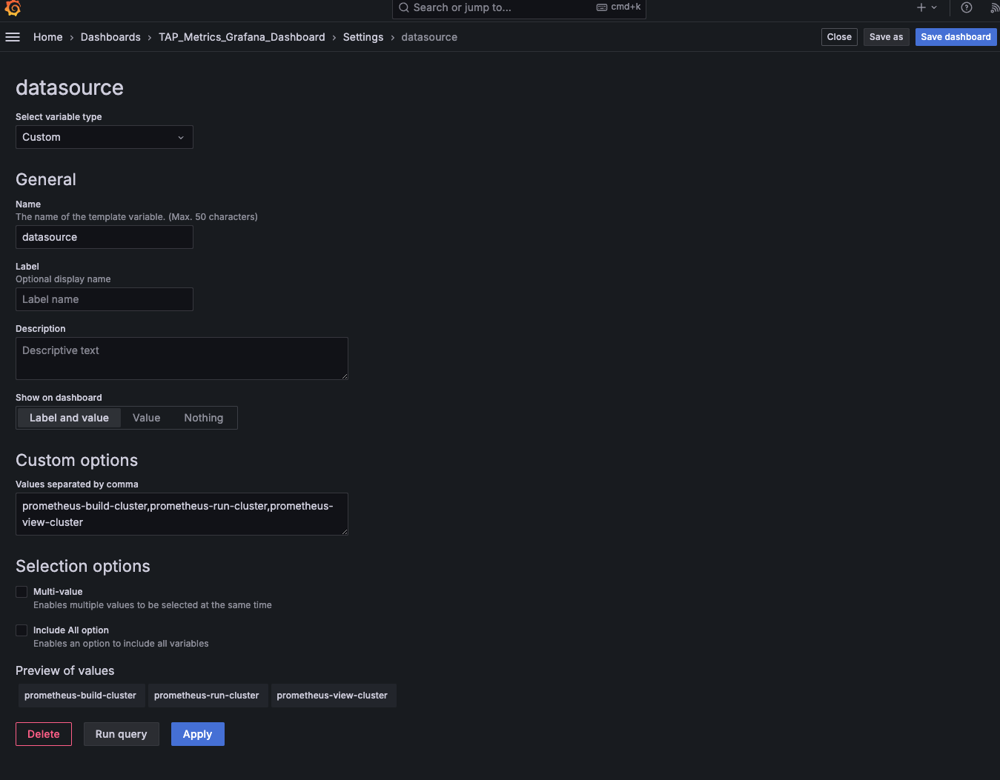

# Grafana Dashboard for Tanzu Application Platform


1.1.1. Context

Configuration and setup public Grafana-Prometheus helm with TAP CR metrics collection


Pre-requisites:

  1. Kubectl and Helm should be installed
  2. Kubernetes cluster with TAP and TAP workloads

1.1.2. Downloading and setting up cluster

Complete the following steps:

  1. Download the Tanzu CLI binary from the [VMware Tanzu Network](https://network.pivotal.io/products/tanzu-application-platform/)
     a. Go to VMware Tanzu Network.
     b. Choose the TAP tile
         

     c. Click the item "Grafana Dashboard for Tanzu Application Platform (Beta)" from the result set.
     d. Download the "prometheus-grafana-dashboard-for-tap-1.0.0-beta.1.zip" onto your machine.

   2. Use an extraction tool to unpack the binary file:

        **macOS**:

        unzip prometheus-grafana-dashboard-for-tap-1.0.0-beta.1.zip

        **Linux**:

        unzip prometheus-grafana-dashboard-for-tap-1.0.0-beta.1.zip

        **Windows**:

        Use the Windows extractor tool to unzip prometheus-grafana-dashboard-for-tap-1.0.0-beta.1.zip

   3. **Apply** the tap-metrics.taml file on to the TAP cluster which enables collection of the TAP CustomResource metrics


   4. **Install** public helm chart for Prometheus with public http endpoint in **all TAP clusters** that needs to be added to observability. For this example, it is considered that there will be three TAP clusters - one View cluster, one Build cluster and one Run cluster

      a. Set context to View cluster and Install the Prometheus public helm chart using the below commands,
        ```
        # Add Prometheus helm repo
        helm repo add prometheus-community https://prometheus-community.github.io/helm-charts
        helm repo update
         
        # Install prometheus chart
        helm install prometheus -f <DOWNLOADED_tap-metrics.yaml> prometheus-community/kube-prometheus-stack --namespace tap-monitoring --create-namespace
        ```
      b. Repeat Step 4.a for Build and Run clusters
      c. Now we have a Prometheus endpoint (for each of the cluster) which will act as a data source for Grafana in later steps. Note the public LoadBalancer IP <PUBLIC_ENDPOINT> from below command in each of the cluster where Prometheus is installed,
      ```
        kubectl get svc -n tap-monitoring | grep prometheus
        prometheus-operated                          ClusterIP      None           <none>            9090/TCP                        20h
        tap-observability-kube-pro-prometheus        LoadBalancer   10.0.19.222    <PUBLIC_ENDPOINT> 9090:32357/TCP,8080:31323/TCP   20h
        tap-observability-prometheus-node-exporter   ClusterIP      10.0.34.213    <none>            9100/TCP                        20h
      ```
       d. Note that here the example is given only for http endpoints exposed to public. Users have to follow their own security practices like private endpoints, TLS mechanism, etc.
     5. Moving on to Centralized Grafana, where we can create a single dashboard to view metrics from different TAP cluster,

       a. Create Grafana values yaml (grafana-values.yaml in this example) with different prometheus endpoints captured above along with the port (default 9090 for prometheus)
      ```
      datasources:
          datasources.yaml:
            apiVersion: 1
            datasources:
            - name: prometheus-view-cluster
              type: prometheus
              url: <VIEW_CLUSTER_PROMETHEUS_ENDPOINT>:9090
              access: proxy
              isDefault: true
            - name: prometheus-build-cluster
              type: prometheus
              url: <BUILD_CLUSTER_PROMETHEUS_ENDPOINT>:9090
              access: proxy
              isDefault: false
            - name: prometheus-run-cluster
              type: prometheus
              url: <RUN_CLUSTER_PROMETHEUS_ENDPOINT>:9090
              access: proxy
              isDefault: false
      ```
       b. Install Grafana in a cluster dedicated for the Grafana dashboard using below commands updating the <DEFAULT_PVC_STORAGE_CLASS> and <PASSWORD_TO_LOG_INTO_GRAFANA_ENDPOINT>,

        ```
        kubectl create ns grafana
         
        #Add grafana helm repo
        helm repo add grafana https://grafana.github.io/helm-charts
        helm repo update
         
        # Install the chart - set your grafana user and password in command
        helm install grafana grafana/grafana \
            --namespace grafana \
            --set persistence.storageClassName=<DEFAULT_PVC_STORAGE_CLASS> \
            --set persistence.enabled=true \
            --set adminPassword='<PASSWORD_TO_LOG_INTO_GRAFANA_ENDPOINT>' \
            --values  grafana-values.yaml \
            --set service.type=LoadBalancer
         
        # <DEFAULT_PVC_STORAGE_CLASS> - some examples 'default' for Azure, 'gp2' for AWS, etc
         
        # In case any auto-generate mechanism is used, users can get grafana userid and password using below command 
        kubectl get secret --namespace grafana grafana -o jsonpath="{.data.admin-password}" | base64 --decode ; echo
        ```
       c. Access Grafana UI via the <PUBLIC_ENDPOINT> created by the default LoadBalancer (could be configured behind any ingress service)
      ```
        kubectl get svc -n grafana
        NAME      TYPE           CLUSTER-IP     EXTERNAL-IP        PORT(S)        AGE
        grafana   LoadBalancer   10.0.133.110   <PUBLIC_ENDPOINT>  80:31147/TCP   20h
      ```
       d. Login to the Grafana UI using above endpoint and configured username/password (default username 'admin' if not configured above)
       e. Import the TAP_dashboard.json downloaded via TAP artifact download in step 1
        i. Navigate to Dashboards page
      
 
        ii. Click on New → Import
      

        iii. Select and import the downloaded dashboard from Step 2 named TAP_Grafana_Dashboard.json
      

        iv. View the TAP health dashboard for different TAP clusters by selecting the right datasource
      

        v. Sample data for packageinstalls and workloads with failures in build cluster
      

      

       f. Users can bring their own set of Datasources, configure the datasources in the Dashboard variable like below
        i. Navigate to Dashboard Settings
      

        ii. Navigate to Variables tab, click on the datasource variable, update the proper datasource names in the datasource variable under "Custom options" and **Save** the dashboard
      

      


